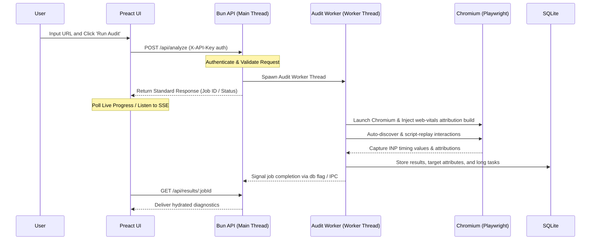
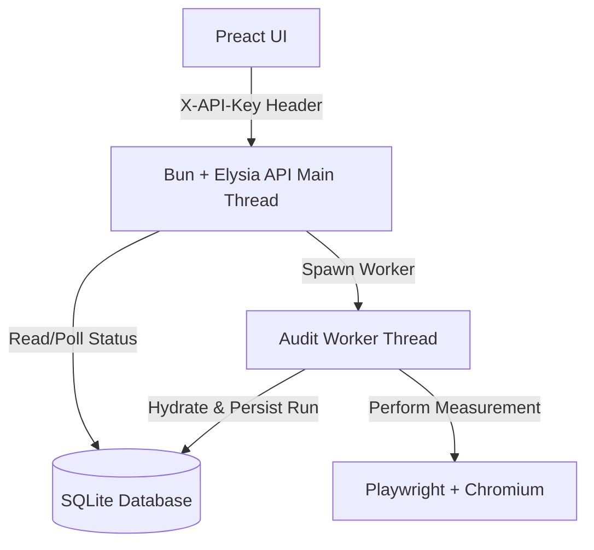

# INP Debugger

Open-source, self-hostable **Interaction to Next Paint (INP) debugger** focused only on INP measurement, analysis, and regression tracking.

Developed by **[MasterKN48](https://github.com/MasterKN48)**  
Official Repository: **[github.com/MasterKN48/inpDebugger](https://github.com/MasterKN48/inpDebugger)**

This project is designed as a fast, lightweight developer tool that gives a similar style of insight to Google PageSpeed Insights and DebugBear's INP debugger, but for local, staging, authenticated, CI, and self-hosted environments.

---

## Goal

Build a self-hosted INP debugger that:

- Measures INP with Chromium using the Event Timing API and the `web-vitals` attribution build
- Explains _why_ a given interaction is slow by breaking it into:
  - Input Delay
  - Processing Duration
  - Presentation Delay
- Works on localhost, preview, staging, authenticated flows, and production
- Is fast and lightweight to run locally
- Can run as:
  - a desktop app
- Stays tightly scoped to **INP only**

---

## Final Stack

### Backend / Runtime

- **Bun** (High-performance JS runtime & package manager)
- **Elysia** for high-performance, modular HTTP API routes
- **Worker Threads** (`worker_threads`) for offloading heavy, CPU-bound Playwright/Chromium instances from the main web thread
- **bun:sqlite** for local SQLite database persistence
- **Pino Logger** for high-performance structured JSON logging in production and colorized pretty-printing in development
- **OWASP Secure Headers** + CORS hardening and client-server API Key authentication via `.env` basic authorization

### Measurement Engine

- **Playwright** (isolated runner orchestration)
- **Chromium only**
- **`web-vitals` attribution build** for INP collection
- **Chrome DevTools Protocol (CDP)** for tracing and long-task analysis

### Frontend

- **Preact** + Preact Hooks
- **Tailwind CSS** (modern HSL glassmorphism, responsive sidebar layout)
- **Dynamic Canvas Favicon** for real-time pulsing neon tab icons synchronized to active application states

---

## Why Chromium Only

This tool uses **Chromium only** because INP measurement quality matters more than raw crawl speed.

Reasons:

- INP depends on browser capabilities exposed through the Event Timing API
- `web-vitals` attribution works reliably with Chromium-based measurement flows
- Playwright + Chromium gives one consistent environment for:
  - page load
  - interaction simulation
  - INP capture
  - long-task tracing
  - screenshots / trace export
- A single browser engine keeps results easier to trust and debug

This project intentionally avoids multi-browser measurement complexity.

---

## What INP Means

INP measures the latency of a user interaction until the next visual update is painted.

For each interaction, the debugger should measure three parts:

1. **Input Delay** — time before the event handler starts
2. **Processing Duration** — time spent running JS handlers
3. **Presentation Delay** — time from handler completion to the next paint

The tool should report:

- the worst interaction on the page
- the top slowest interactions
- the phase breakdown for each slow interaction
- likely causes linked to the slow phase

### Scoring Bands

Use Google's INP thresholds:

- **Good:** `<= 200ms`
- **Needs Improvement:** `> 200ms and <= 500ms`
- **Poor:** `> 500ms`

---

## Product Scope

This product is intentionally **limited to INP**.

Do not expand into a full Lighthouse clone.

### In Scope

- INP measurement
- interaction discovery
- interaction scripting
- long-task correlation
- main-thread blocking analysis
- per-interaction breakdown
- regression tracking for INP
- developer diagnostics tied to INP
- export/reporting for INP

### Out of Scope

- LCP scoring
- CLS scoring
- SEO audits
- accessibility audits
- best-practice audits
- network waterfall analysis unrelated to INP
- bundle-size analysis unless directly tied to interaction latency
- general synthetic monitoring platform features

---

## Core Product Modes

### 1. Local Developer App

A desktop/local UI where a developer enters a URL and runs an INP analysis.

---

## Architecture

```text
┌──────────────────────────────────────────────────────┐
│                    INP Debugger                      │
├──────────────────────────────────────────────────────┤
│ Frontend                                             │
│  - Preact                                             │
│  - Tailwind CSS                                       │
│  - shadcn-style Preact components                     │
├──────────────────────────────────────────────────────┤
│ Backend                                               │
│  - Bun                                                │
│  - Elysia API                                         │
│  - bun:sqlite                                         │
├──────────────────────────────────────────────────────┤
│ Measurement Engine                                    │
│  - Playwright                                         │
│  - Chromium                                           │
│  - web-vitals attribution                             │
│  - CDP tracing                                        │
├──────────────────────────────────────────────────────┤
│ Packaging                                             │
│  - Tauri desktop app                                  │
│  - Docker server mode                                 │
│  - CLI mode                                           │
└──────────────────────────────────────────────────────┘
```

---

## High-Level Flow

```text
User enters URL
   ↓
Backend creates analysis job
   ↓
Playwright launches Chromium
   ↓
Page loads with chosen profile (desktop/mobile)
   ↓
INP measurement script is injected
   ↓
Interaction targets are discovered or loaded from user script
   ↓
Interactions are replayed one by one
   ↓
web-vitals captures INP candidates and attribution
   ↓
CDP captures long tasks and performance events
   ↓
Results are scored, stored, and returned to UI
   ↓
UI shows worst interactions, phase breakdowns, and regressions
```

---

## Measurement Strategy

### Synthetic Lab Measurement

The tool performs **synthetic INP measurement** using scripted interactions in Chromium.

This is not the same as CrUX field data, but it is useful because it can test:

- local development URLs
- preview deployments
- staging environments
- authenticated dashboards
- flows that PSI cannot test directly

### Primary Measurement Source

Use the `web-vitals` attribution build inside the page context to collect:

- current INP value
- interaction target
- input delay
- processing duration
- presentation delay
- interaction type
- load state

### Supporting Analysis

Use CDP to capture:

- long tasks over 50ms
- scripting activity near the interaction window
- timing context around slow interactions

---

## Interaction Discovery Strategy

Support two complementary modes.

### Auto Discovery Mode

Automatically detect likely interaction targets, such as:

- buttons
- links
- menu items
- form fields
- searchable inputs
- tabs
- accordions
- custom elements with click handlers
- elements with `role="button"`
- keyboard-submittable controls

### Scripted Mode

Allow users to define an explicit interaction script.

Example:

```json
[
  { "type": "click", "selector": "#menu-button" },
  { "type": "click", "selector": "[data-tab='reports']" },
  { "type": "type", "selector": "#search", "text": "invoice" },
  { "type": "press", "selector": "#search", "key": "Enter" }
]
```

Scripted mode is preferred for repeatable CI and authenticated flows.

---

## Main Features

### Current Core Features

#### Measurement

- Chromium-only INP analysis
- Three-phase INP breakdown per interaction
- Worst interaction detection
- Top slow interactions ranking
- Desktop and mobile profiles
- Auto-discovery of interaction targets
- Scripted interaction support
- Long-task correlation with interactions
- INP threshold scoring
- Result persistence for history

#### Diagnostics

- Show whether slowness is dominated by:
  - input delay
  - processing duration
  - presentation delay
- Show associated interaction target
- Show interaction type (click, key, tap-like pointer flow)
- Show load state during measurement
- Flag likely causes based on the slow phase

#### UI / Product

- Fast single-page dashboard
- Real-time run progress
- Historical result list
- Regression comparison view
- Exportable report
- Desktop packaging

---

## Suggested New Features (Still Limited to INP)

These are the recommended next features. Keep all future work strictly INP-focused.

### High Priority

#### 1. Interaction Heatmap

Overlay the page screenshot and color interactive elements by INP severity.

Use cases:

- visually identify the slowest controls
- quickly spot problem areas without reading tables first

#### 2. Before/After Comparison

Compare two analysis runs and show:

- INP delta
- changed worst interaction
- changed phase distribution
- whether regression came from input delay, processing, or presentation

#### 3. Authenticated Session Support

Accept Playwright `storageState` or reusable cookies so internal dashboards can be tested.

#### 4. CI Budget Enforcement

Allow a build to fail if:

- worst INP exceeds a threshold
- a specific critical interaction exceeds a threshold
- regression exceeds an allowed delta

#### 5. HTML Report Export

Generate a standalone HTML report with charts, tables, screenshots, and recommendations.

### Medium Priority

#### 6. Interaction Trace Export

Export trace data for a selected slow interaction so developers can inspect it further.

#### 7. Root-Cause Heuristics

Infer likely causes such as:

- long synchronous event handlers
- forced reflow/layout thrash
- excessive DOM size affecting presentation delay
- expensive framework rerender after input

#### 8. Keyboard Flow Testing

Measure INP for keyboard-driven flows, not just pointer clicks.

#### 9. Scroll + Interact Scripts

Support actions where the page must be scrolled before the target interaction is replayed.

#### 10. Critical Interaction Watchlist

Allow teams to pin important selectors and track their INP separately over time.

### Lower Priority

#### 11. Component / Framework Attribution

For supported apps, try to identify the React/Preact/Vue component subtree involved in a slow interaction.

#### 12. Webhook Notifications

Send alerts when a monitored interaction regresses.

#### 13. Multi-Run Stability Mode

Run the same interaction multiple times and report min / median / max INP to reduce noise.

---

## UX Requirements

The UI should feel fast and minimal.

### Design Principles

- lightweight, utilitarian interface
- no clutter
- low cognitive load
- diagnostics first, decoration second
- optimized for engineers, not marketing

### UI Stack Guidance

- Use **Preact** for minimal bundle size
- Use **Tailwind CSS** for fast implementation
- Use a **shadcn-style design system** adapted for Preact
- Prefer simple primitives over complex component dependencies

### Main Screens

#### 1. Run Screen

- URL input
- device selector
- optional auth/session selection
- optional interaction script upload
- run button

#### 2. Live Progress Screen

- current phase
- interaction count progress
- active selector being tested
- estimated time remaining if possible

#### 3. Results Screen

- overall INP score
- badge: Good / Needs Improvement / Poor
- top slow interactions
- per-interaction phase bars
- long-task correlation panel
- likely-cause summaries
- history / regression link

#### 4. History Screen

- sortable past runs
- filters by URL / branch / environment
- compare selected runs

---

## API Design

### `POST /api/analyze`

Start a new analysis run.

#### Request

```json
{
  "url": "https://example.com",
  "profile": "mobile",
  "interactions": [
    { "type": "click", "selector": "#add-to-cart" },
    { "type": "type", "selector": "#search", "text": "shoe" }
  ],
  "auth": {
    "storageStatePath": "./auth/admin.json"
  },
  "budget": {
    "maxINP": 200
  }
}
```

#### Response

```json
{
  "jobId": "job_01HXYZ123"
}
```

### `GET /api/results/:jobId`

Return full analysis results.

Example response shape:

```json
{
  "jobId": "job_01HXYZ123",
  "url": "https://example.com",
  "profile": "mobile",
  "overallINP": 318,
  "score": "needs-improvement",
  "worstInteraction": {
    "selector": "#search",
    "type": "keydown",
    "inputDelay": 54,
    "processingDuration": 198,
    "presentationDelay": 66,
    "total": 318
  },
  "interactions": [],
  "longTasks": [],
  "createdAt": "2026-05-16T01:00:00.000Z"
}
```

### `GET /api/history`

List previous runs.

### `GET /api/progress/:jobId`

Server-Sent Events endpoint for live progress.

### `POST /api/compare`

Compare two stored runs.

---

## Data Model

Use SQLite tables like these:

### `runs`

- `id`
- `url`
- `profile`
- `score`
- `overall_inp`
- `worst_selector`
- `created_at`
- `git_sha` (optional)
- `environment` (optional: local/staging/prod)

### `interactions`

- `id`
- `run_id`
- `selector`
- `type`
- `input_delay`
- `processing_duration`
- `presentation_delay`
- `total_inp`
- `load_state`
- `target_text` (optional)
- `target_html_snippet` (optional)

### `long_tasks`

- `id`
- `run_id`
- `interaction_id` (nullable)
- `start_time`
- `duration`
- `category`
- `attribution`

### `budgets`

- `id`
- `project_name`
- `max_inp`
- `critical_selector`
- `max_selector_inp`

---

## Project Structure

```text
inp-debugger/
├── apps/
│   ├── desktop/                   # Tauri wrapper
│   ├── web/                       # Preact frontend
│   └── server/                    # Bun + Elysia API
├── packages/
│   ├── core/                      # Shared types, scoring, utilities
│   ├── measurement/               # Playwright + Chromium engine
│   ├── storage/                   # SQLite access layer
│   ├── reporting/                 # HTML/JSON export builders
│   └── ui/                        # Shared UI primitives if needed
├── scripts/
│   ├── dev.ts
│   ├── build.ts
│   └── ci-check.ts
├── docker/
│   └── Dockerfile
├── docs/
│   ├── architecture.md
│   ├── api.md
│   └── heuristics.md
├── package.json
├── bunfig.toml
└── README.md
```

---

## Frontend Component Plan

Use small, composable components.

### Core Components

- `RunForm`
- `ProfileSelect`
- `InteractionScriptEditor`
- `ProgressPanel`
- `ScoreCard`
- `InteractionTable`
- `InteractionBreakdownChart`
- `LongTaskPanel`
- `RunHistoryTable`
- `RunCompareView`
- `ExportReportButton`

### UI Rules

- Keep components presentational where possible
- Avoid heavy state libraries unless necessary
- Prefer local state + derived selectors
- Use TanStack Query only if server cache complexity becomes real
- Keep charts lightweight

---

## Coding Guidance for Agent

### Backend Rules

- Keep measurement logic isolated from HTTP layer
- Build the measurement engine as a reusable package first
- Make every analysis run deterministic where possible
- Separate auto-discovery, replay, scoring, and persistence modules
- Avoid hidden magic heuristics; make scoring and rules explicit

### Frontend Rules

- Build the results UI around engineering workflows
- Surface the worst interaction first
- Make table sorting, comparison, and filtering easy
- Prefer dense information layout over oversized cards
- Keep the initial bundle small

### Performance Rules

- Avoid unnecessary runtime dependencies
- Prefer Bun native features where possible
- Keep desktop package size small
- Do not add analytics SDKs or heavy UI frameworks
- Lazy-load heavy views like compare/history/reporting

### Reliability Rules

- Every interaction replay must have timeout protection
- Handle missing selectors gracefully
- Save partial results if a run fails halfway
- Mark flaky interactions separately from valid measurements
- Log enough data to reproduce a failed run

---

## Suggested Build Order

### Phase 1 — Core Engine

Build:

- Bun monorepo
- Playwright Chromium runner
- `web-vitals` injection
- interaction discovery
- scripted interaction replay
- raw result capture

### Phase 2 — Scoring + Persistence

Build:

- INP scoring logic
- worst-interaction ranking
- SQLite schema
- run history storage
- compare API

### Phase 3 — Dashboard

Build:

- Preact app shell
- run form
- live progress UI
- results view
- history view
- comparison view

### Phase 4 — Packaging

Build:

- Docker server mode
- desktop wrapper with Tauri
- CLI budget mode for CI

### Phase 5 — Advanced Diagnostics

Build:

- root-cause heuristics
- HTML export report
- critical interaction watchlist
- authenticated session workflows

---

## CLI Examples

### Analyze a Page

```bash
bun run cli analyze --url https://example.com --profile mobile
```

### Analyze with Script

```bash
bun run cli analyze \
  --url https://example.com \
  --profile desktop \
  --script ./flows/search.json
```

### Check Budget in CI

```bash
bun run cli check-budget \
  --url https://staging.example.com \
  --profile mobile \
  --max-inp 200
```

### Compare Two Runs

```bash
bun run cli compare --run-a run_101 --run-b run_145
```

---

## Report Output

The tool should support these export formats:

- JSON
- HTML report
- CLI summary output

### HTML Report Should Include

- URL
- profile used
- overall INP score
- threshold badge
- worst interaction summary
- interaction ranking table
- phase breakdown bars
- long-task summaries
- likely-cause heuristics
- comparison with previous baseline if available

---

## Risks / Constraints

### 1. Synthetic vs Field Data

Synthetic INP is useful, but it is not identical to CrUX field data.

### 2. Interaction Coverage

Auto-discovery may miss custom or hidden flows, so scripted mode is required for serious projects.

### 3. Measurement Noise

INP can vary between runs, especially on complex apps; multi-run mode may be needed later.

### 4. Framework Attribution Complexity

Component-level attribution is valuable but hard; it should be a later feature, not an MVP dependency.

---

## Non-Goals

Do not let the project drift into:

- full website auditing
- uptime monitoring platform features
- screenshot testing platform features
- synthetic SEO crawler features
- generic browser automation product features

Keep it focused on **debugging and tracking INP**.

---

## Recommended MVP Definition

The MVP is successful when it can:

1. Accept a URL
2. Launch Chromium
3. Discover or replay interactions
4. Measure INP per interaction
5. Show the worst interaction
6. Break down Input Delay, Processing Duration, and Presentation Delay
7. Persist results
8. Compare runs
9. Export a useful report

---

## Final Product Summary

Build a lean INP-focused developer tool with:

- **Bun** backend
- **Playwright + Chromium** measurement engine
- **Preact** frontend
- **Tailwind CSS** UI styling
- **shadcn-style** design system adapted for Preact
- **SQLite** persistence
- **desktop** delivery modes

The tool should be opinionated, fast, minimal, and excellent at one thing: **finding, explaining, and tracking slow interactions**.

---

## Required Supporting Documents

In addition to the application code, the repository should include the following implementation documents so a coding agent can execute the project in a structured way.

### 1. `tasks.md`

Create a root-level `tasks.md` file containing step-by-step implementation milestones.

This file should break the project into small, ordered execution tasks such as:

- repository bootstrap
- monorepo/workspace setup
- Bun + Elysia server setup
- Playwright + Chromium measurement engine
- `web-vitals` injection layer
- interaction discovery module
- scripted interaction runner
- SQLite schema and persistence
- scoring engine
- API endpoints
- Preact dashboard shell
- results views
- history and comparison pages
- export/report generation
- desktop packaging

Each task should include:

- objective
- files to create/update
- dependencies on previous tasks
- acceptance criteria
- optional stretch follow-ups

The goal of `tasks.md` is to let a coding agent complete the project milestone by milestone without ambiguity.

### 2. Detailed API Contract Files

Create a `docs/api/` folder with detailed contract files.

Recommended structure:

```text
docs/
└── api/
    ├── overview.md
    ├── analyze.md
    ├── results.md
    ├── progress.md
    ├── history.md
    ├── compare.md
    ├── auth-sessions.md
    ├── budgets.md
    └── schemas/
        ├── run.json
        ├── interaction.json
        ├── long-task.json
        ├── analyze-request.json
        ├── analyze-response.json
        └── compare-response.json
```

Each API contract document should define:

- endpoint purpose
- HTTP method
- path
- request headers
- request body schema
- response schema
- status codes
- validation rules
- example requests
- example responses
- error cases
- backward-compatibility notes if needed

JSON schema files should be machine-readable and usable for validation and contract testing.

### 3. PRD + Technical Design Split

Split product and engineering detail into two separate docs.

Recommended files:

```text
docs/
├── prd.md
└── technical-design.md
```

#### `docs/prd.md`

This file should focus on product requirements:

- problem statement
- target users
- core jobs to be done
- scope
- non-goals
- MVP definition
- success metrics
- feature priorities
- UX expectations
- release phases

#### `docs/technical-design.md`

This file should focus on engineering design:

- architecture overview
- package/module responsibilities
- data flow
- measurement lifecycle
- persistence design
- replay strategy
- failure handling
- packaging strategy
- CI strategy
- trade-offs and risks

Use Mermaid diagrams where useful, for example:

- system architecture
- sequence flow for an analysis run
- module dependency graph
- database entity relationships

Example Mermaid sequence:



Example Mermaid architecture:



These documents are required project artifacts, not optional notes.

---

## Updated Repository Deliverables

The repository is expected to contain both code and planning/design documents.

```text
inp-debugger/
├── apps/
├── packages/
├── docs/
│   ├── prd.md
│   ├── technical-design.md
│   ├── api/
│   │   ├── overview.md
│   │   ├── analyze.md
│   │   ├── results.md
│   │   ├── progress.md
│   │   ├── history.md
│   │   ├── compare.md
│   │   └── schemas/
│   └── heuristics.md
├── tasks.md
├── scripts/
├── package.json
├── bunfig.toml
└── README.md
```

---

## Coding Agent Deliverable Checklist

A coding agent working on this repository should produce all of the following:

- application source code
- `README.md`
- `tasks.md`
- `docs/prd.md`
- `docs/technical-design.md`
- full `docs/api/` endpoint contracts
- machine-readable schema files under `docs/api/schemas/`
- Docker/server mode setup
- desktop wrapper setup
- CI budget-check workflow

Do not treat the documentation artifacts as secondary. They are part of the required implementation output.
