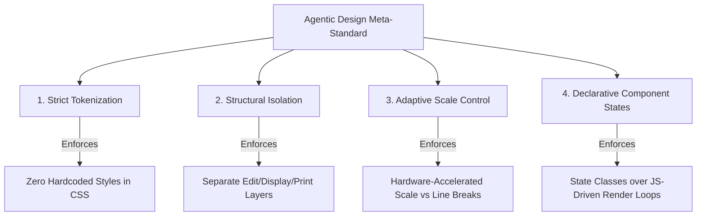

# 📐 Universal Design System Blueprint & Architectural Template

> **Optimized for Agentic Coding IDEs & AI Co-Pilots**

This document serves as both a **Universal Design System Blueprint** for AI-driven development and the **Absolute Technical Design Reference** for **PocketResume**.

Agentic coding environments (such as Roo Code, Cline, and Antigravity) require highly structured, token-driven, and isolated styles to build, refactor, and modify user interfaces autonomously without breaking layouts. This blueprint establishes the standard for documenting design systems to ensure maximum AI code integrity, visual excellence, and zero-redraw styling transitions across **any** type of web application.

---

## 🏗️ Part 1: The Agentic Design Framework (Meta-Standard)

To allow developer AI agents to safely write, extend, and debug application interfaces, any design system must satisfy four core meta-standards:



### 1. Strict Visual Tokenization

All variables (colors, typography, margins, border radii, shadows) must reside in a unified custom property system (e.g., `variables.css`). Agents must interact exclusively with these tokens. **Hardcoding values inside CSS files is strictly prohibited.**

### 2. Structural Layer Isolation

Applications must completely separate structural workspaces (e.g., documents, canvas layers, dashboards) from interactive editing handles, floating action menus, and chat panels. Interactive and system components must utilize custom layout isolation identifiers (like `.hide-print` or popover attributes) to prevent styling leakage into final user outputs (like PDF exports, screenshots, or code copies).

### 3. Adaptive Viewport Scaling

To support absolute layout integrity across all devices (desktop, tablet, mobile), apps should implement mathematical viewport-scaling (e.g., using CSS `transform: scale()`) inside high-fidelity containers. This prevents screen wrapping, text overlap, and broken aspects on small screens without complicating media queries.

### 4. Glassmorphism & High-End Aesthetics

Standard, plain, and flat UI components fail to deliver premium user experiences. Applications built by AI agents should proactively incorporate modern aesthetics like layered glassmorphism, dynamic gradients, refractive borders, and smooth micro-interactions.

---

## 🎨 Part 2: Active Implementation Blueprint (Case Study: PocketResume)

Below is the concrete implementation of this agentic design system applied to the **PocketResume** Progressive Web App.

### 1. Unified Color Palette (Slate Theme)

PocketResume is optimized to run on the **Slate theme**, which provides a professional, high-density, and accessible visual signature. While [variables.css](file:///Users/nitinkumar/Work/resumeTemplate/src/styles/variables.css) structurally contains color token slots for future expansions, the application locks active rendering to these Slate custom properties:

| Theme Attribute Selector | CSS Variable     | Color Value                | Description                                                 |
| :----------------------- | :--------------- | :------------------------- | :---------------------------------------------------------- |
| `[data-theme="slate"]`   | `--accent-color` | `#334155`                  | Structural headings, professional titles, highlighted lines |
| `[data-theme="slate"]`   | `--bg-color`     | `#f8fafc`                  | Main application backdrop background                        |
| `[data-theme="slate"]`   | `--pill-bg`      | `#f1f5f9`                  | Tag pills, badge backgrounds, modern sidebar background     |
| `[data-theme="slate"]`   | `--line-color`   | `#e2e8f0`                  | Grid separators, section lines, input boxes dashed outlines |
| `[data-theme="slate"]`   | `--hover-bg`     | `#f1f5f9`                  | Editing hover zones and input field backgrounds             |
| `[data-theme="slate"]`   | `--input-bg`     | `rgba(255, 255, 255, 0.7)` | Standard edit mode input backdrops                          |

> [!NOTE]
> Standardizing on a single unified theme guarantees strict WCAG AA color accessibility, perfect visual contrast ratios, and flawless print-to-paper ink densities on all physical and digital exports.

### 2. Typography Sizing Scale

PocketResume uses a dynamic typography scale governed by the user's global settings (`small`, `medium`, or `large` presets) and fine-tuned by a dynamic `fontScale` coefficient (`0.8` to `1.2`).

| CSS Variable   | Default (Medium) | Target Context                                |
| :------------- | :--------------- | :-------------------------------------------- |
| `--fs-name`    | `42px`           | Primary applicant name in header              |
| `--fs-prof`    | `15px`           | Profession / job title subtitles              |
| `--fs-section` | `17px`           | Section headers (e.g., Experience, Education) |
| `--fs-job`     | `15px`           | Individual role/company designations          |
| `--fs-body`    | `14px`           | Description texts and list bullet items       |
| `--fs-small`   | `13px`           | Meta labels, dates, contact values            |

---

## 🏛️ Template Architectures & Transition Sliders

PocketResume supports two distinct design paradigms (A4 structures) rendered on a side-by-side transition viewport slider, allowing instant template switching.

### 1. The Classic Template (`resume-classic.css`)

- **Aesthetic**: Centered, balanced, single-column design. Highly optimized for academic, legal, or traditional business resumes.
- **Key Features**:
  - Centered main header with deep tracking (`letter-spacing: 2px`) for the candidate's name.
  - Inline, dot-separated contact items (`.contact-separator` is `1px` wide, colored in `--line-color` to provide clean visual dividing lines).
  - Full-width section margins with left-border accent structures.

### 2. The Modern Template (`resume-modern.css`)

- **Aesthetic**: Asymmetric, split-pane grid. Perfect for technical, creative, or product management resumes.
- **Key Features**:
  - Asymmetrical layout defined by: `grid-template-columns: 260px 1fr`.
  - Left-hand sidebar (using `--pill-bg` as a container fill) holding contact details, high-density skills badges, and certifications.
  - Right-hand main column hosting broad descriptions, professional history, and project summaries.

### 3. Transition Slider (`resume-core.css`)

To prevent page jumpiness during template switches, both layouts exist inside a single `1600px` horizontal slider container (`.resume-slider`) wrapped in a clipping viewport (`.resume-slider-viewport`). The slide transition is handled via high-performance hardware-accelerated CSS transforms:

```css
.resume-slider.template-active-classic {
  transform: translateX(0%);
}
.resume-slider.template-active-modern {
  transform: translateX(-800px);
}
```

- **Transition Details**: Uses a spring-feeling cubic-bezier `transition: transform 0.6s cubic-bezier(0.23, 1, 0.32, 1)` to keep layout transitions extremely smooth and fluid.

---

## 🛠️ Interactive Widgets & Floating Controls

PocketResume hosts a system of glassmorphism utility bars that coordinate themes, fonts, manual breaks, and scaling factors.

### 1. The Floating Navigation Dock (`floating-bar.css`)

Positioned `fixed` at the bottom of the page, this dashboard serves as the command center:

- **Glass Styling**: Integrates a multi-step background composition:
  ```css
  background:
    radial-gradient(circle at 30% 0%, rgba(255, 0, 128, 0.08), transparent 60%),
    radial-gradient(
      circle at 70% 100%,
      rgba(64, 224, 208, 0.08),
      transparent 60%
    ),
    rgba(255, 255, 255, 0.6);
  backdrop-filter: blur(28px) saturate(180%);
  ```
- **Liquid Flow Conic Borders**: A custom animated border wrapper is established using `@property --angle` and a continuous `@keyframes liquidFlow` loop. By mapping a `conic-gradient` through `--angle`, a glowing colored line flows around the perimeter of the dock without using CPU-heavy JavaScript render loops.
- **Glass Tooltips**: Active tooltips are managed cleanly via raw CSS `::after` content injection. Hover states translate, scale, and fade-in tooltips smoothly:
  ```css
  .action-btn::after {
    content: attr(title);
    position: absolute;
    bottom: 110%;
    left: 50%;
    transform: translateX(-50%);
    opacity: 0;
    transition: all 0.3s cubic-bezier(0.4, 0, 0.2, 1);
  }
  .action-btn:hover::after {
    opacity: 1;
  }
  ```
- **Responsive Collapsing**: On screens smaller than `600px`, the floating bar adapts by converting to horizontal columns, reducing padding, hiding desktop tooltips, and expanding select menus to fit full width.

---

## ✏️ Interactive Live Editing Layer (`edit-mode.css`)

When "Edit Mode" is engaged, the document is retrofitted with high-utility dashed indicators, floating control docks, reordering triggers, and page break tools.

### 1. Hover Boundaries & Anchored Controls

- **Section Boxes (`.sec-box`)**: Outlined by a soft transparent border that transforms on hover into a solid `--accent-color` boundary. The section controls (`.section-controls`) are absolutely positioned `top: -22px; right: 15px` and spring into view with a `cubic-bezier(0.34, 1.56, 0.64, 1)` scale transition.
- **Item Boxes (`.relative-box`)**: Placed within individual section lists. Hovering reveals item adjustments (`.item-controls`) positioned off-page (`right: -40px`) to prevent visual obstruction of text inputs.

### 2. Live Form Inputs

- **Editing inputs (`.edit-input`)**: Completely unstyled by default, matching the exact typography and sizing of the container text. In edit mode, they transition to a dashed `--accent-color` frame:
  ```css
  .edit-input {
    background-color: var(--input-bg);
    border: 1px dashed var(--accent-color);
    border-radius: 4px;
    padding: 2px 4px;
  }
  ```
  This ensures that the document's structure matches the printable output as closely as possible even while editing.

### 3. Drag and Drop Layout Shifts

- **Dragging State (`.dragging`)**: Elements undergoing reordering are applied with `.dragging` which lowers their opacity (`0.4`) and replaces standard backgrounds with dashed accent variables.
- **Minimized State (`.section-minimized`)**: Users can collapse bulky sections during reordering. Collapsed sections hide list entries and skills lists (`display: none !important`), dropping margins to `5px` to provide a compact view.

---

## 🤖 WebGPU & Remote AI Assistant UI (`ai-chatbot.css`)

The AI Career Assistant interface is styled as a premium chat bubble hovering above the resume viewport, utilizing specialized masks and hardware animations.

### 1. Chat Trigger Bubble

- **Positioning**: Sits at `right: 2rem; bottom: 2rem` on desktop. To avoid blocking the floating navigation dock on mobile browsers, it adjusts dynamically to `bottom: 10.5rem` or relies on mobile view scaling to preserve viewport accessibility.
- **Ready Pulse State**: When the local LLM is loaded and WebGPU hardware acceleration is online, the chat button initiates a deep shadow-glowing animation (`ready-pulse`) that shifts scale and changes box shadows.

### 2. Cinematic Streaming Fade Effect

- **Problem**: Raw SSE token generation causes rapid, jittery shifts in layout height and text weight, disrupting focus.
- **Solution**: To eliminate jitter, the chatbot UI leverages a specialized linear gradient mask on the streaming element (`.chat-message.ai.streaming`):
  ```css
  .chat-message.ai.streaming {
    mask-image: linear-gradient(
      to bottom,
      black 0%,
      black 80%,
      transparent 100%
    );
    -webkit-mask-image: linear-gradient(
      to bottom,
      black 0%,
      black 80%,
      transparent 100%
    );
    mask-size: 100% 100%;
  }
  ```
  This creates a beautiful "fade-in" effect at the bottom boundary of the newly generated text, hiding partial lines and smoothing out the scrolling transition as new text streams in.

---

## 🔔 Glassmorphic Toast Notification System (`toast.css`)

PocketResume uses a dynamic, stackable, non-blocking toast notification system to present application events, safety alerts (such as GPU or memory crash warnings), and action confirmations.

### 1. Visual Specification & Glassmorphism

To fit seamlessly into the design aesthetic, toast notifications employ high-saturation backdrops and custom refractive borders:

- **Backdrop**: `background: rgba(255, 255, 255, 0.75)` with `backdrop-filter: blur(24px) saturate(200%)`.
- **Border**: `1px solid rgba(255, 255, 255, 0.5)` creating a premium, light-catching chamfered edge.
- **Shadow**: A composite layered drop shadow:
  ```css
  box-shadow:
    0 10px 25px -5px rgba(0, 0, 0, 0.1),
    0 4px 10px -2px rgba(0, 0, 0, 0.05);
  ```
- **Status Color Accents**: Actionable color cues for status icons:
  - `Success`: `#10b981` (emerald green)
  - `Error`: `#ef4444` (rose red)
  - `Info`: `#3b82f6` (royal blue)

### 2. Positioning & Mobile Adaptive Layout

- **Desktop Layout**: Positioned at `top: 1.5rem; right: 1.5rem` to avoid overlapping center actions or active resume forms.
- **Mobile Adaptations**: Evaluated at `< 600px` screen widths to prevent overlapping floating navigation controls at the bottom of the screen:
  ```css
  @media (max-width: 600px) {
    .toast-container {
      top: auto;
      bottom: 100px;
      left: 1.5rem;
      right: 1.5rem;
    }
  }
  ```

### 3. Entry & Exit Animations

To create a fluid, premium feel, the toasts use hardware-accelerated spring curves for entrance and exit:

- **Entrance (`toastIn`)**: Animates over `0.5s cubic-bezier(0.175, 0.885, 0.32, 1.275)` (a subtle spring overshoot) from `translateX(30px) scale(0.9)` to standard scale/position.
- **Exit (`toastOut`)**: Accelerates away over `0.4s cubic-bezier(0.4, 0, 0.2, 1)` to `translateX(30px) scale(0.9)`.

---

## ⚡ PDF Parsing Scanning Overlays (`components.css`)

When a candidate uploads a raw PDF to prefill their profile, a full-screen scanning engine displays the ingestion phase.

```css
/* Scanning laser animation */
@keyframes scanning {
  0% {
    transform: translateY(0);
    opacity: 0.2;
  }
  50% {
    transform: translateY(80px);
    opacity: 1;
  }
  100% {
    transform: translateY(0);
    opacity: 0.2;
  }
}

/* Linear background gradient tracking parsing progress */
.progress-bar-fill {
  height: 100%;
  background: linear-gradient(90deg, var(--accent-color), #f97316);
  transition: width 0.3s cubic-bezier(0.4, 0, 0.2, 1);
}
```

---

## 🖨️ Print Optimization Engine (`print.css`)

The print styles in [print.css](file:///Users/nitinkumar/Work/resumeTemplate/src/styles/print.css) are designed to output a flawless, high-contrast PDF using standard A4 dimensions. When a user prints or exports, the browser switches to `@media print` rules, applying the following transformations:

### 1. Document Page Setup

- Forces exact A4 portrait dimensions and strips margins to avoid double-paging headers/footers:
  ```css
  @page {
    size: A4 portrait;
    margin: 0mm;
  }
  ```

### 2. Complete Layout Isolation

- Hides all editing widgets, overlays, navigation bars, PWA install prompts, and chat overlays:
  ```css
  .hide-print,
  .floating-bar,
  .info-banner,
  .template-indicator,
  .template-nav-btn,
  .ai-container {
    display: none !important;
  }
  ```

### 3. Slider Reset & Page-Flow Structuring

- During active use, the resume is wrapped inside sliding tracks and scale transforms. In print mode, these are completely flattened (`transform: none !important`, `zoom: 1 !important`, `overflow: visible !important`) to allow multi-page documents to flow naturally.
- **A4 Aspect Ratio Forcing**: Resets the container width to exactly `210mm` (standard A4 width) with subtle margins to prevent clipping:
  ```css
  @media print {
    .resume-wrapper,
    .resume-slide,
    .resume-container {
      width: 210mm !important;
      min-width: 210mm !important;
      max-width: 210mm !important;
      padding: 5mm 10mm !important;
    }
  }
  ```

### 4. Page Break Controls

- Provides support for manual page breaks inserted via the floating controls, forcing layout resets:
  ```css
  .page-break {
    page-break-after: always;
    break-after: page;
    height: 0;
    border: none;
  }
  /* Margin reset for sections beginning on new pages */
  .page-break + .section {
    margin-top: 8mm;
  }
  ```

---

## ⚙️ Part 3: Reusing this Blueprint for Other Application Archetypes

This meta-standard can be instantly cloned and refactored by AI developer agents to construct other software categories:

### 1. SaaS Dashboard / Analytics Workspace

- **Strict Visual Tokenization**: Define variables for high-density tables (`--row-padding`), chart colors (`--chart-accent`), and light/dark theme toggles.
- **Structural Layer Isolation**: Sidebar navigation panels, user-dropdown popovers, and chat widgets are marked `.hide-ui` to allow users to capture clean data reports, CSV snapshots, or print canvas reports without interface clunky boxes.
- **Adaptive Scale Control**: Charts and metric cards use dynamic scale container bindings to prevent data visualization overlaps or layout breaks on tablet screens.

### 2. Rich Text Editor / Notion Clone

- **Strict Visual Tokenization**: Declare structural typographical line-heights (`--lh-para`), list block paddings, and font sizes matching writing modes (Sans, Serif, Monospace).
- **Structural Layer Isolation**: Hover-formatting panels, active floating blocks, and slash command search drawers must be styled inside isolated portals, ensuring that when the document is printed or locked to read-only, those widgets completely disappear.
- **Adaptive Scale Control**: Scales side columns dynamically based on line length limits to avoid typographic eye strain.

### 3. Developer Tool / Code Playfield

- **Strict Visual Tokenization**: Set monospace-first font-hierarchies (`--font-mono`), code editor backdrops (`--editor-bg`), and strict contrast syntax variables.
- **Structural Layer Isolation**: Isolated compiler overlays, console feedback nodes, and code copy icons are marked with `.control-hide` to ensure only raw source content is captured or printed.
- **Adaptive Scale Control**: Tracks code box dimensions and applies dynamic scrolling (`overflow: auto`) inside scaled bounding containers to prevent out-of-boundary code clipping.

---

## 🧭 Developer & Agent Extension Guidelines

When updating or extending the styling system of PocketResume or any cloned application, you MUST follow these strict guidelines:

1.  **Variables Over Constants**: Never hardcode colors, margins, or fonts within individual stylesheets. Always bind values to the variables declared in `variables.css`.
2.  **Synchronized Theme Declarations**: If you define a new theme color in a light palette, ensure you also define its equivalent in dark themes (e.g., `noir`, `navy`, `forest`) to prevent broken contrast states.
3.  **Class-Based Isolation**: When introducing active overlays, always double check that they are styled with the `.hide-print` class or placed inside containers hidden by `@media print` rules.
4.  **Mobile Pinch-Zoom & Scale Stability**: Maintain parent bounds of `.resume-container` exactly inside `useScale` calculation bounds. Dynamic zooming must rely on overall viewport matrix adjustments to prevent text overlapping.
