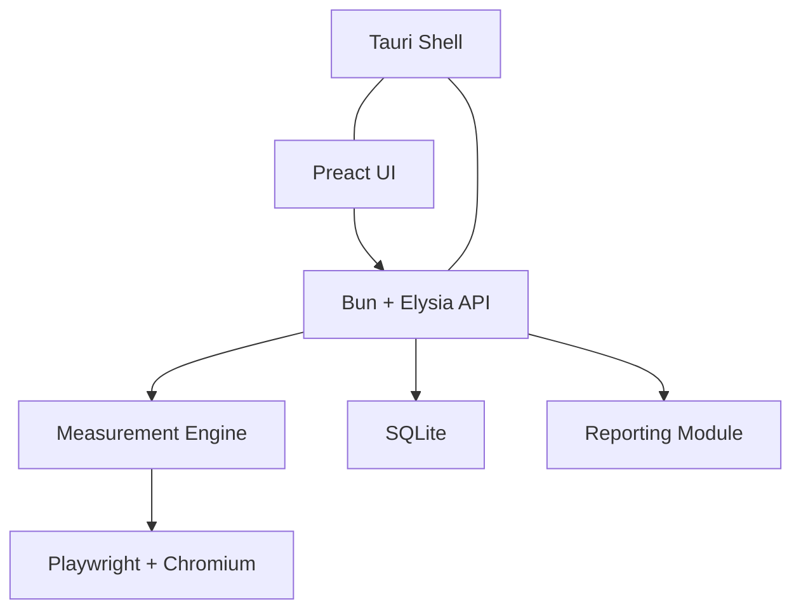
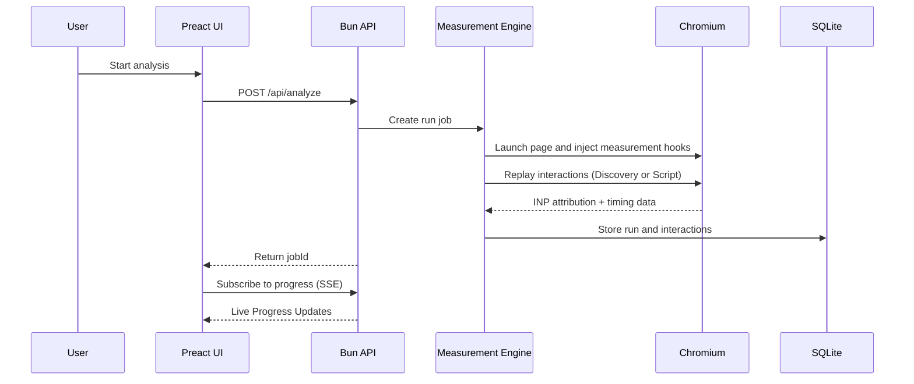

# Technical Design: INP Debugger

## Architecture Overview

The system is designed as a modular monorepo powered by Bun and Tauri.

## Module Responsibilities

### `apps/web` (Frontend)
- **Framework:** Preact (minimal bundle size).
- **Styling:** Tailwind CSS + Shadcn-style components.
- **State:** Local state for active runs, TanStack Query for history.
- **Delivery:** Served within the Tauri webview.

### `apps/server` (Backend API)
- **Runtime:** Bun.
- **Language:** JavaScript (ESM).
- **Framework:** Elysia.
- **Documentation:** Swagger (via `@elysiajs/swagger`).
- **Role:** Orchestrates measurement jobs, manages SQLite persistence, and serves the frontend.

### `packages/measurement` (The Engine)
- **Measurement:** Playwright with Chromium.
- **Instrumentation:** Injects a custom script using the `web-vitals` attribution build.
- **Capture:** Collects Event Timing events, attribution data, and CDP trace for long tasks.

### `packages/storage` (Persistence)
- **Database:** `bun:sqlite`.
- **Schema:** Tracks `runs`, `interactions`, and `long_tasks`.

## Measurement Lifecycle

## Packaging Strategy (Tauri)
- **Framework:** Tauri.
- **Multi-platform:** Supports macOS, Windows, and Linux.
- **Backend:** Tauri sidecar or integrated Bun server.
- **Webview:** Uses system native webview (WKWebView on macOS, WebView2 on Windows, WebKitGTK on Linux).
